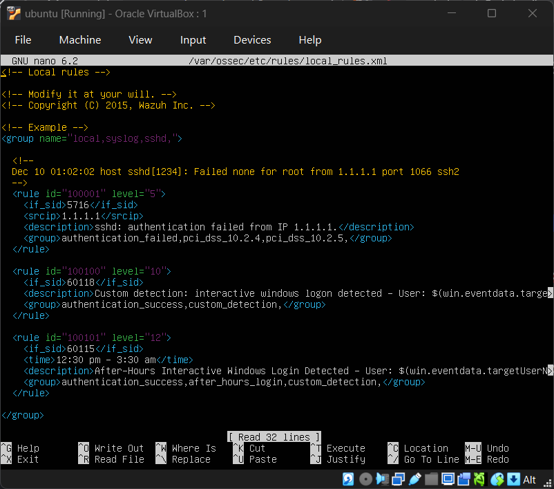

# 03 – After-Hours Interactive Windows Logon Detection using Wazuh

## Overview

One of the common indicators of unauthorized access is an interactive logon occurring outside an organization's normal business hours. Attackers who successfully obtain valid credentials often attempt to access systems late at night or during periods when user activity is minimal, reducing the likelihood of immediate detection.

This project demonstrates how to build a custom detection rule in Wazuh that identifies successful Windows interactive logins occurring outside predefined business hours. The detection generates a high-severity alert whenever a user successfully logs in during non-business hours.

This project is part of my SOC Analyst Detection Engineering series where custom detection logic is developed and validated using realistic attack simulations.

---

# Objectives

- Detect successful Windows interactive logons
- Identify logins occurring outside business hours
- Generate high-priority alerts for security analysts
- Reduce alert noise by ignoring normal working-hour logins
- Demonstrate custom rule creation in Wazuh
- Map detections to the MITRE ATT&CK framework

---

# Lab Environment

| Component | Details |
|-----------|---------|
| SIEM | Wazuh 4.x |
| Manager | Ubuntu Server |
| Endpoint | Windows 10 |
| Agent | Wazuh Agent |
| Log Source | Windows Security Event Logs |
| Event ID | 4624 |
| Decoder | windows_eventchannel |

---

# Detection Logic

Windows generates Event ID **4624** whenever a user successfully logs on.

Instead of alerting on every successful login, the detection focuses only on:

- Successful logon
- Interactive Logon (Logon Type 2)
- Outside predefined business hours

Business hours were defined as:

```
03:30 AM UTC
to
12:30 PM UTC
```

Any successful interactive logon outside this time window generates a Level 12 alert.

---

# Why UTC Time Was Used

Wazuh internally evaluates event timestamps using Coordinated Universal Time (UTC).

Although the Windows endpoint displayed local time, the event timestamps received by the Wazuh Manager were normalized into UTC before rule evaluation.

To ensure accurate detections, the custom rule was written using UTC instead of local system time.

*Using UTC prevents inconsistent detections when endpoints are deployed across different geographic regions or time zones.*

---

# Custom Wazuh Rules

## Rule 100100

Detects successful Windows interactive logons.

```xml
<rule id="100100" level="10">
    <if_sid>60118</if_sid>
    <description>Interactive Windows Logon Detected</description>
    <group>
        authentication_success,
        custom_detection
    </group>
</rule>
```

---

## Rule 100101

Detects interactive logons occurring outside business hours.

```xml
<rule id="100101" level="12">
    <if_sid>100100</if_sid>
    <time>12:30 pm - 3:30 am</time>
    <description>After-Hours Interactive Windows Logon Detected</description>
    <group>
        authentication_success,
        after_hours_login,
        custom_detection
    </group>
</rule>
```



---

# Detection Workflow

```
Windows User Login
        │
        ▼
Windows Security Log
(Event ID 4624)
        │
        ▼
Wazuh Agent
        │
        ▼
Wazuh Manager
        │
        ▼
Rule 60115
(Successful Logon)
        │
        ▼
Custom Rule 100101
(Time Validation)
        │
        ▼
Level 12 Alert
Displayed in Dashboard
```

---

# Alert Details

Generated alert includes:

- Username
- Computer Name
- Event ID
- Logon Type
- Source IP
- Timestamp
- Process Name
- Authentication Package
- Rule ID
- Rule Level

---

# Sample Detection

**Rule ID**

```
100101
```

**Severity**

```
Level 12
```

**Event ID**

```
4624
```

**Logon Type**

```
2 (Interactive)
```

**User**

```
vboxuser
```

**Host**

```
WIN10
```

---

# MITRE ATT&CK Mapping

| Technique | ID |
|------------|----|
| Valid Accounts | T1078 |
| Local Accounts | T1078.001 |
| Interactive Logon | TA0001 (Initial Access) |
| Persistence using Valid Accounts | TA0003 |
| Defense Evasion using Valid Credentials | TA0005 |

Although this project simply detects an after-hours login, the behavior aligns closely with the use of valid credentials by an attacker after initial compromise.

---

# Detection Strategy

The detection uses multiple layers:

- Windows Security Event Logs
- Wazuh Event Decoder
- Built-in Windows authentication rules
- Time-based filtering
- Custom correlation rule
- High-severity alert generation

This layered approach significantly reduces false positives while maintaining visibility into suspicious authentication activity.

---

# Validation

The detection was validated by:

- Logging into the Windows endpoint during business hours
- Logging into the Windows endpoint outside business hours
- Confirming only after-hours logins generated the custom alert
- Verifying event fields inside Wazuh Dashboard

---

# Screenshots

Include the following screenshots:

1. Lab Architecture
2. Custom rules inside `local_rules.xml`
3. Wazuh Manager restart
4. Generated Level 12 Alert
5. Expanded alert details
6. Event ID 4624
7. Rule Groups
8. Full Event JSON
9. Dashboard showing alert timeline

---

# Future Improvements

- Integrate Active Directory user validation
- Exclude service accounts from detection
- Trigger email notifications
- Generate Slack alerts
- Automatically create incident tickets
- Add GeoIP correlation
- Detect impossible travel
- Detect multiple after-hours logins from different hosts
- Build active response playbooks

---

# Skills Demonstrated

- Detection Engineering
- Windows Event Log Analysis
- Windows Authentication Monitoring
- Wazuh Custom Rule Development
- SOC Alert Tuning
- Security Monitoring
- SIEM Administration
- Threat Detection
- Log Analysis
- MITRE ATT&CK Mapping

---

# Key Takeaways

This project demonstrates how custom Wazuh rules can be used to identify potentially suspicious authentication events by incorporating business logic into detection engineering.

Rather than generating alerts for every successful login, the detection focuses only on interactive logins occurring outside approved working hours. This significantly improves signal-to-noise ratio while highlighting activity that warrants analyst investigation.

The project also reinforces the importance of understanding Windows authentication events, SIEM rule creation, time normalization using UTC, and aligning detections with the MITRE ATT&CK framework.
