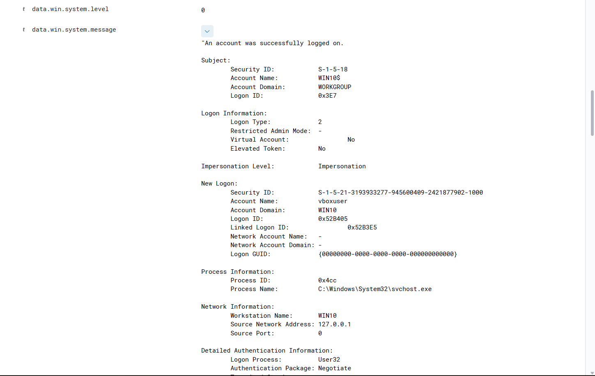
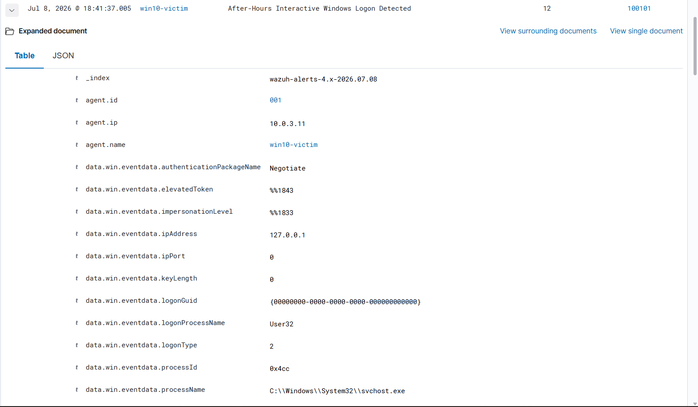
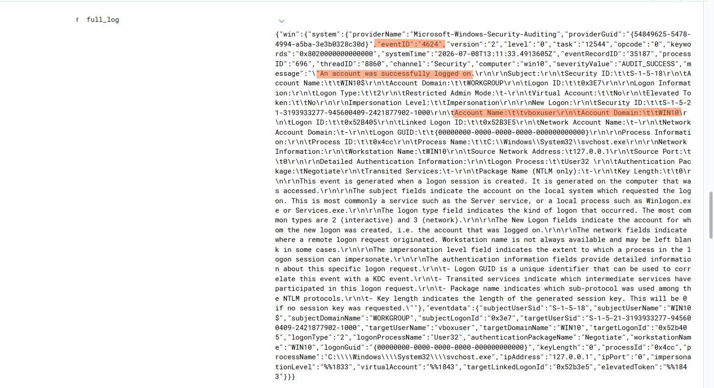

# 03 – After-Hours Interactive Windows Logon Detection using Wazuh


# Objectives

- Detect successful Windows interactive logons.
- Monitor authentication activity outside approved business hours.
- Reduce alert fatigue by suppressing expected daytime logins.
- Generate high-severity alerts for potentially suspicious authentication events.
- Demonstrate custom rule development and correlation in Wazuh.
- Improve analyst visibility into abnormal user behavior.
- Align detections with the MITRE ATT&CK framework.

---

# Threat Scenario

One of the most common post-compromise attacker behaviors is the use of valid credentials to access systems when legitimate users are unlikely to be active.

Examples include:

- Stolen employee credentials
- Insider misuse
- Unauthorized remote access
- Persistence after initial compromise
- Lateral movement using compromised accounts

Since many organizations experience very little legitimate user activity during late-night hours, monitoring successful interactive logins outside business hours provides analysts with an additional behavioral indicator that deserves investigation.

---

# Lab Environment

| Component | Details |
|------------|---------|
| SIEM Platform | Wazuh 4.7.5 |
| Wazuh Manager | Ubuntu Server |
| Endpoint | Windows 10 |
| Agent | Wazuh Agent |
| Log Source | Windows Security Event Logs |
| Event Decoder | `windows_eventchannel` |
| Event ID Monitored | 4624 |
| Logon Type | Interactive (Type 2) |

---

# Windows Event Analysis

Windows records every successful authentication using **Event ID 4624**.

This event contains valuable information including:

- Username
- Computer Name
- Logon Type
- Source IP Address
- Authentication Package
- Process Name
- Security Identifier (SID)
- Timestamp

However, generating alerts for every Event ID 4624 would create significant noise because successful logins occur continuously during normal business operations.

Instead, this project introduces contextual filtering based on time.

---

# Detection Logic

The detection follows three stages:

### Stage 1

Windows generates **Event ID 4624** when a successful authentication occurs.

↓

### Stage 2

Wazuh's built-in Windows authentication rules identify successful interactive logons. Also biult a custom rule to identify the same.

↓

### Stage 3

A custom rule evaluates the event timestamp.

If the login occurs **outside approved business hours**, Wazuh generates a **Level 12** security alert.

---

# Business Hour Configuration

Business hours were defined as:

```text
12:30 PM UTC
to
3:30 AM UTC
```

This corresponds to approximately:

```text
06:00 PM IST
to
09:00 AM IST
```

Any successful interactive login occurring outside this UTC time window triggers the custom detection.

---

# Why UTC Was Used

Wazuh evaluates rule time conditions using **Coordinated Universal Time (UTC)** rather than the local timezone displayed on Windows endpoints.

Although Windows displays timestamps in Indian Standard Time (IST), events are normalized into UTC before rule evaluation.

For this reason, the custom rule was written using UTC values.

Using UTC ensures:

- Consistent detections across different time zones
- Accurate rule evaluation
- Standardized event correlation
- Easier management in distributed environments

---

# Custom Detection Rules

## Rule 100100 – Interactive Windows Logon Detection

This rule identifies successful interactive Windows logons using Wazuh's built-in authentication rule as its parent.

```xml
<rule id="100100" level="10">
    <if_sid>60118</if_sid>
    <description>Interactive Windows Logon Detected</description>
    <group>
        authentication_success,
        custom_detection
    </group>
</rule>
```

### Purpose

- Detect successful interactive authentication
- Create a reusable parent rule
- Separate authentication detection from business logic

---

## Rule 100101 – After-Hours Interactive Logon

This rule evaluates the login timestamp and generates an alert only when authentication occurs outside business hours.

```xml
<rule id="100101" level="12">
    <if_sid>100100</if_sid>
    <time>12:30 pm - 3:30 am</time>
    <description>After-Hours Interactive Windows Logon Detected</description>
    <group>
        authentication_success,
        after_hours_login,
        custom_detection
    </group>
</rule>
```

### Purpose

- Monitor after-hours authentication
- Apply business-hour filtering
- Reduce false positives
- Generate a high-priority SOC alert


---

## Detection Workflow

```text
                 Windows User Login
                        │
                        ▼
          Windows Security Event Log
                 Event ID 4624
                        │
                        ▼
                 Wazuh Agent
                        │
                        ▼
                Wazuh Manager
                        │
                        ▼
          Built-in Authentication Rule
                 (Rule 60118)
                        │
                        ▼
        Custom Rule 100100
  Interactive Logon Detected
                        │
                        ▼
        Custom Rule 100101
    Business Hour Validation
                        │
                        ▼
          Level 12 Alert Generated
                        │
                        ▼
          Wazuh Dashboard Alert
```

---

# Alert Information

When the rule is triggered, the alert includes:

- Username
- Computer Name
- Event ID
- Logon Type
- Source IP Address
- Process Name
- Authentication Package
- Rule ID
- Rule Level
- Timestamp
- Rule Groups

These fields provide analysts with sufficient context to begin an authentication investigation.





---

# Detection

| Field | Value |
|--------|-------|
| Rule ID | 100101 |
| Severity | Level 12 |
| Event ID | 4624 |
| Logon Type | 2 (Interactive) |
| User | vboxuser |
| Host | WIN10 |
| Detection | After-Hours Interactive Login |





---

# MITRE ATT&CK Mapping

| Tactic | Technique | ID | Relevance |
|---------|-----------|----|-----------|
| Initial Access | Valid Accounts | T1078 | Attackers often use legitimate credentials to gain access to systems. |
| Initial Access | Local Accounts | T1078.001 | Applies when a local Windows account is used for authentication. |

Although a successful login alone does not confirm malicious activity, attackers frequently rely on valid credentials after gaining initial access. Monitoring authentication behavior outside expected working hours helps analysts identify suspicious account usage that may otherwise go unnoticed.

---

# Validation Process

The detection was tested using two authentication scenarios.

### Test 1 – Business Hours Login

- User logged in during approved business hours.
- Event ID 4624 was generated.
- Parent authentication rule matched.
- No after-hours alert was generated.

**Result:** ✅ Expected behavior.

---

### Test 2 – After-Hours Login

- User logged in outside business hours.
- Event ID 4624 was generated.
- Parent authentication rule matched.
- Time validation succeeded.
- Custom Rule 100101 generated a Level 12 alert.

**Result:** Detection worked successfully.

---

# Detection Strategy

This project demonstrates a layered detection approach:

- Windows Security Event Logging
- Wazuh Event Decoding
- Built-in Authentication Rules
- Custom Correlation Rules
- Time-Based Filtering
- Alert Prioritization
- MITRE ATT&CK Mapping

Instead of relying solely on Event IDs, the detection combines authentication events with business context to improve detection quality while minimizing unnecessary alerts.

---

# Possible Security Use Cases

This detection can assist SOC analysts in identifying:

- Compromised user accounts
- Stolen credentials
- Insider threats
- Unauthorized workstation access
- Suspicious administrator logins
- Persistence using valid accounts
- Authentication during maintenance windows
- Early indicators of lateral movement

---

# Future Improvements

This detection can be extended by integrating additional security controls, including:

- Active Directory user validation
- Service account exclusions
- GeoIP enrichment
- Impossible travel detection
- Privileged account monitoring
- Multiple failed logins followed by success
- Brute-force correlation
- Email notifications
- Slack or Microsoft Teams alerts
- Active Response scripts
- Automatic incident ticket creation
- Integration with SOAR platforms

---

# Skills Demonstrated

This project demonstrates practical experience in:

- Detection Engineering
- Security Monitoring
- SIEM Administration
- Wazuh Custom Rule Development
- Windows Event Log Analysis
- Authentication Monitoring
- SOC Alert Tuning
- Threat Detection
- Log Analysis
- Event Correlation
- MITRE ATT&CK Mapping
- Security Operations

---

# Key Takeaways

This illustrates how simple contextual logic can significantly improve authentication monitoring within a SIEM platform.

Rather than generating alerts for every successful login, the solution applies business-hour awareness to identify authentication events that are more likely to warrant investigation. By combining Windows Security Event Logs, Wazuh's built-in detection capabilities, and custom rule correlation, the detection provides meaningful, high-confidence alerts while reducing unnecessary noise.

It also reinforces essential SOC concepts including Windows authentication monitoring, Wazuh rule development, UTC-based time normalization, detection engineering, and behavioral threat detection aligned with the MITRE ATT&CK framework.
